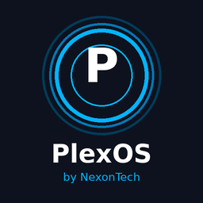
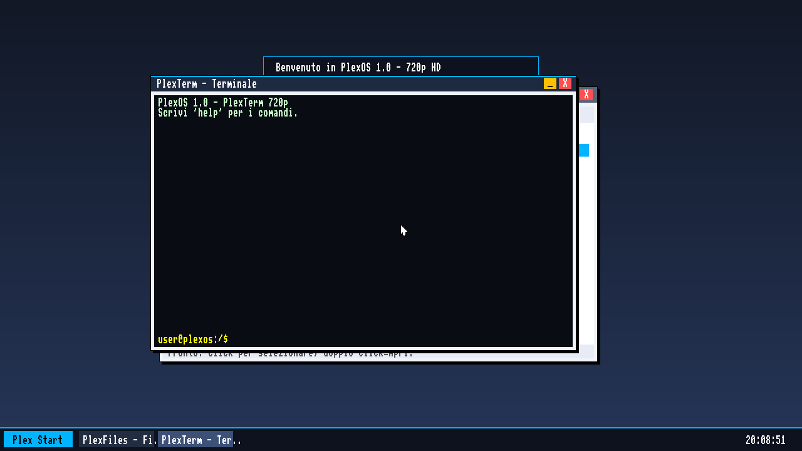
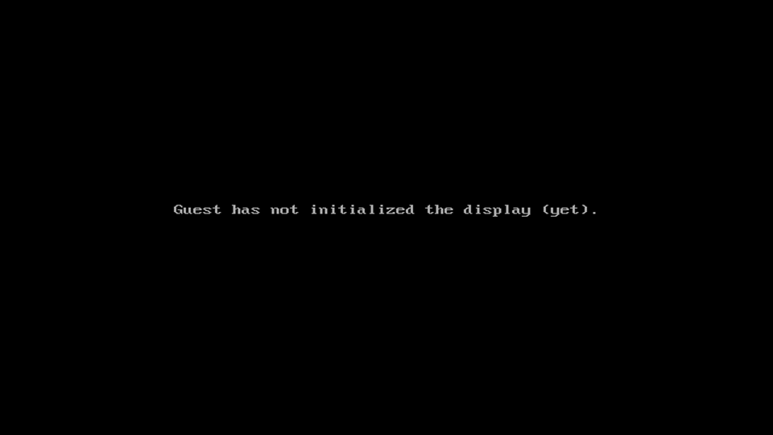
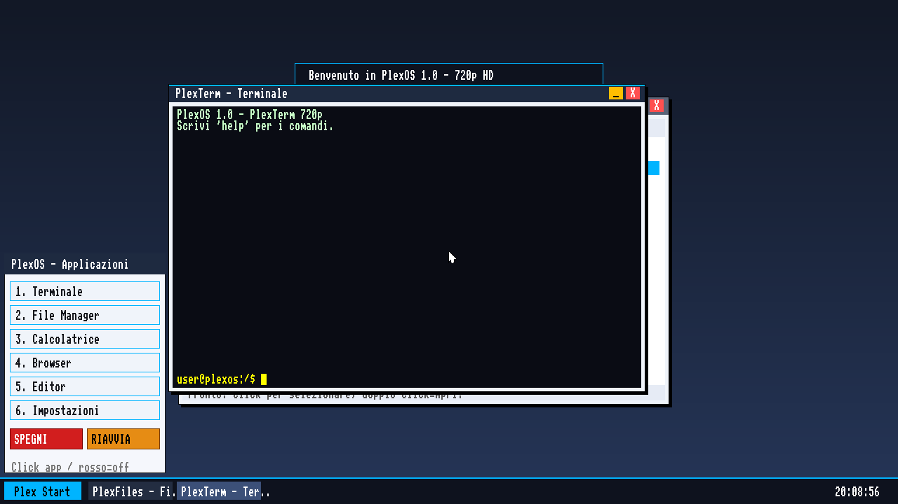

<p align="center">
  
</p>

<h1 align="center">🖥️ PlexOS</h1>

<p align="center">
  <b>An operating system written from scratch in C and Assembly (x86), with a graphical GUI, desktop, windows, Start menu and 6 apps.</b><br/>
  <i>A NexonTech project — the whole kernel, drivers and GUI are original.</i>
</p>

<p align="center">
  <a href="https://nexontechnux.github.io/PlexOS/"><b>🌐 Visit the website</b></a> ·
  <a href="https://github.com/NexonTechnux/PlexOS/releases"><b>⬇️ Download</b></a>
</p>

<p align="center">
  
</p>

## ⚠️ Status: QEMU-first

> **PlexOS is tested and tuned on QEMU, where it runs at nearly 60 FPS at 1280x720.**
> Booting on physical hardware is still under active development (test machines: Intel Core i3-1115G4 / Intel UHD display handling — the system is alive even where video isn't visible yet).
> Bottom line: **use QEMU to try PlexOS** and enjoy it to the fullest. 😉

## ✨ What it does

- **Its own boot from zero**: Multiboot (BIOS) + **UEFI** (Multiboot2 + GOP), GDT/IDT, PMM, PSE paging with DMA, heap.
- **Full graphical GUI**: desktop with wallpaper, double buffering + vsync (zero flicker), PS/2 mouse pointer, windows, animated Start menu, taskbar, round-robin multitasking.
- **Hand-written drivers**: VBE framebuffer, Bochs dispi, PS/2 keyboard & mouse, ATA PIO, PCI, RTC, PIT timer, **Intel e1000 networking** (QEMU `-net nic,model=e1000`), CPU detection (SSE, PAT, TSC), Intel display probe (Tiger Lake).
- **VFS filesystem** with built-in partition and disk images.
- **System shell** with **70+ commands**, including: `ls cd pwd cat cp mv rm mkdir touch tree find grep head tail wc du df free ps kill stat mount dmesg history cal sleep fortune date uptime uname lscpu cpuinfo meminfo pci netinfo netstat framebuffer theme sysinfo plexfetch halt reboot poweroff ...`
- **6 apps**:
  - 🗔 **Terminal** — with ANSI emulator and shell.
  - 📂 **File Manager** — filesystem explorer.
  - 🧮 **Calculator** — with expression evaluation engine.
  - 🌐 **Browser** — offline PlexNet pages.
  - 📝 **Editor** — full-screen text editor with save/load.
  - 📊 **Settings** (System / Network / Themes) — from the Start menu.
- **"Blind" diagnostics** for real hardware: full-screen color markers + CAPS LOCK blink codes (up to 11) to locate where boot stops when video isn't up yet.

## 🔨 Build

On Debian/Ubuntu:

```bash
sudo apt install gcc-multilib nasm xorriso grub-pc-bin mtools qemu-system-x86
```

Then:

```bash
make
```

Produces `plexos.iso` (~12 MB), bootable from QEMU **and from USB** (GRUB) via `cp plexos.iso /dev/sdX && sync`.

## ▶️ Run on QEMU

```bash
make run
```

or non-interactively:

```bash
qemu-system-i386 -cdrom plexos.iso -m 256M -vga std \
  -drive id=disk0,if=ide,format=raw,file=/dev/shm/plexos_disk.img \
  -net nic,model=e1000 -net user -rtc base=localtime
```

> `plexos_disk.img` is the filesystem PlexOS mounts. Without a disk the shell only shows a memory partition (`/ram`).

## ⌨️ Inside the GUI

- Start menu: click the icon top-left (**or press F10** with 1-6 selecting an app).
- Windows: drag by the title bar, close with the ✕.
- Shell: `help` for the full list, `plexfetch` for the system page, `theme 0/1/2` to switch themes, `netinfo` for network status.

## 🧠 Architecture (in short)

```
boot/    boot.asm (multiboot 32-bit loader)
kernel/  gdt idt pmm paging heap timer cpu power mb2
drivers/ serial fb keyboard mouse pci ata rtc gpu e1000 bochs intel_disp
fs/      vfs   shell (CLI ~70 commands)
gui/     gui   (windows, menu, wallpaper)
apps/    terminal  fileman  calc  browser  editor  settings(sysmon)
lib/     string  printf  font
```

UEFI 1920x1080 (GOP):

<p align="center"></p>

<p align="center"></p>

## 📜 License

MIT — free and open source. See [LICENSE](LICENSE).

PlexOS is an educational/hobby project by **NexonTech**.